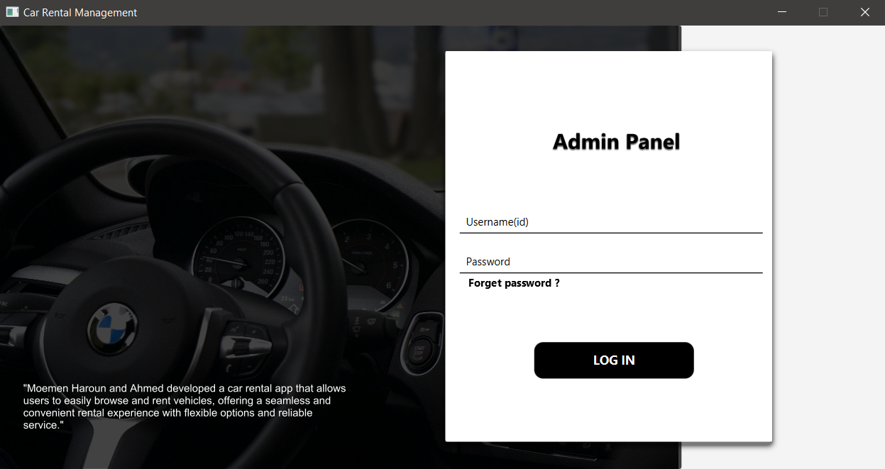
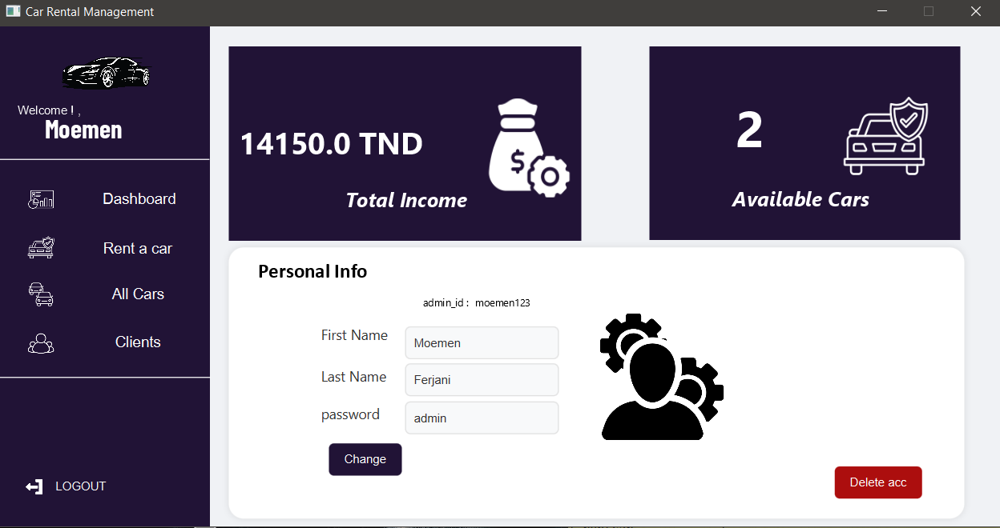
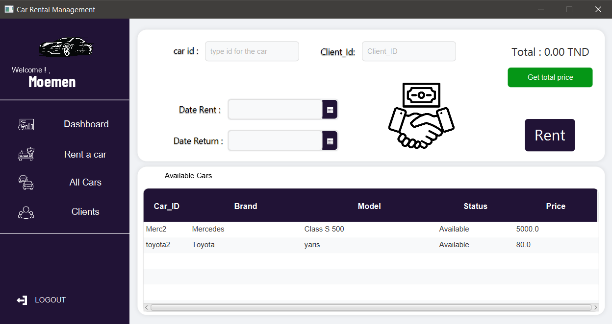
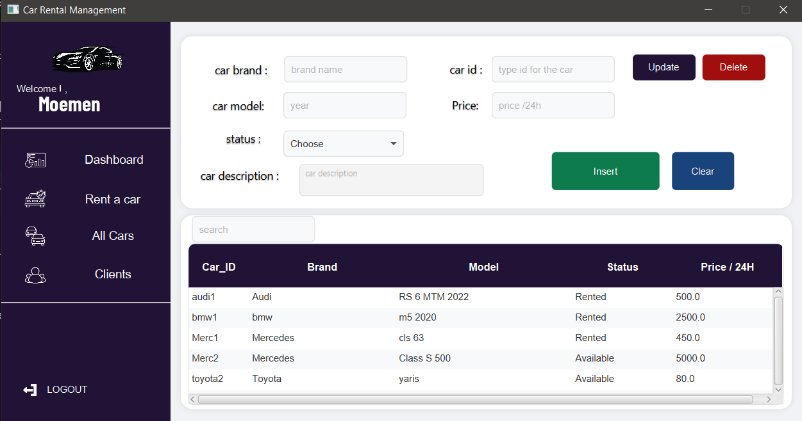
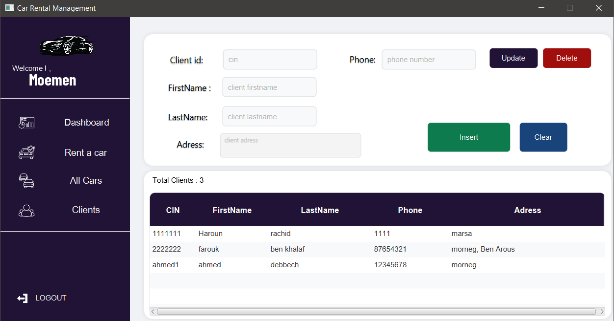

# 🚗 RentCar Management System

A comprehensive desktop application for car rental management built using JavaFX and MySQL. This object-oriented application provides an intuitive interface for managing car rentals, inventory, and customer information.

## 📸 Screenshots

### Login Screen

### Dashboard


### Rent Car Interface


### All Cars Inventory


### Client Management


## ✨ Features

* **User Authentication**
  * Secure login system with role-based access control
  * Password encryption for enhanced security

* **Dashboard**
  * Overview of available and rented cars
  * Daily income statistics and rental metrics
  * Quick access to key functions

* **Car Management**
  * Add, edit, and remove cars from inventory
  * Track car status (available, rented, maintenance)
  * Car details including make, model, year, registration, and pricing

* **Rental Operations**
  * Create and manage rental contracts
  * Calculate rental fees based on duration and car type
  * Handle returns and damage deposits

* **Client Management**
  * Store and manage client information
  * Track rental history and preferences
  * Client loyalty features

* **Reporting**
  * Generate rental reports and invoices
  * Export data to PDF and Excel formats
  * Financial summaries and analytics

## 🛠️ Technologies Used

* **Backend**:
  * Java 11+
  * JavaFX for UI
  * JDBC for database connectivity
  * Maven for dependency management

* **Database**:
  * MySQL 8.0+
  * SQL for querying and data manipulation

* **Design Pattern**:
  * MVC (Model-View-Controller)
  * DAO (Data Access Object)
  * Singleton pattern for database connection

* **Additional Libraries**:
  * JFoenix for modern UI components
  * iText for PDF generation
  * Apache POI for Excel export

## 🚀 Setup & Installation

### Prerequisites
* Java Development Kit (JDK) 11 or higher
* MySQL 8.0 or higher
* Maven (for dependency management)
* IDE (Eclipse, IntelliJ IDEA, or NetBeans recommended)

### Database Setup
1. **Create a MySQL database**:
   ```sql
   CREATE DATABASE rentcar;
   ```

2. **Execute SQL scripts**:
   * Run the included `database_schema.sql` to create tables
   * Optionally run `sample_data.sql` for test data

### Application Setup
1. **Clone the repository**:
   ```bash
   git clone https://github.com/yourusername/rentcar-app.git
   cd rentcar-app
   ```

2. **Configure database connection**:
   * Open `src/main/resources/config.properties`
   * Update MySQL connection parameters:
     ```
     db.url=jdbc:mysql://localhost:3306/rentcar
     db.user=your_username
     db.password=your_password
     ```

3. **Build the project**:
   ```bash
   mvn clean install
   ```

4. **Run the application**:
   ```bash
   mvn javafx:run
   ```
   Or run the generated JAR file:
   ```bash
   java -jar target/rentcar-app-1.0.jar
   ```

## 📂 Project Structure

```
rentcar-app/
├── src/
│   ├── main/
│   │   ├── java/
│   │   │   ├── com/rentcar/
│   │   │   │   ├── controller/     # JavaFX controllers
│   │   │   │   ├── dao/            # Data Access Objects
│   │   │   │   ├── model/          # Entity classes
│   │   │   │   ├── service/        # Business logic
│   │   │   │   ├── util/           # Utility classes
│   │   │   │   └── RentCarApp.java # Main application class
│   │   ├── resources/
│   │   │   ├── fxml/               # JavaFX layouts
│   │   │   ├── css/                # Stylesheet files
│   │   │   ├── images/             # Icons and images
│   │   │   └── config.properties   # Configuration file
│   └── test/                       # Unit tests
├── database/
│   ├── database_schema.sql         # Database creation script
│   └── sample_data.sql             # Sample data script
├── screenshots/                    # Application screenshots
├── pom.xml                         # Maven configuration
└── README.md                       # This file
```

## 🔍 Class Diagram

```
  +----------------+       +-------------------+       +----------------+       +----------------+
  |     Client     |<----->|       Rent        |<----->|       Car      |<----->|     Admin      |
  +----------------+       +-------------------+       +----------------+       +----------------+
  | - client_id    |       | - id_rent         |       | - id           |       | - id           |
  | - firstname    |       | - id_car          |       | - brand        |       | - pass         |
  | - lastname     |       | - id_client       |       | - model        |       | - firstname    |
  | - phone        |       | - id_admin        |       | - price        |       | - lastname     |
  | - adress       |       | - total_earn      |       | - available    |       +----------------+
  +----------------+       | - date_rent       |       | - car_desc     |       
                           | - date_return     |       +----------------+      +----------------+
                           +-------------------+                               |  Access_Track   |
                                                                               +----------------+
                                                                               | - track_id     |
                                                                               | - admin_id     |
                                                                               | - access       |
                                                                               | - access_time  |
                                                                               +----------------+
                           
```

## 🌟 Usage

### Login
 create a new user through the database directly

### Car Management
1. Navigate to the "Cars" section
2. Add new cars using the "+" button
3. View, edit, or delete existing cars

### Rental Process
1. Select a client from the client list
2. Choose available cars
3. Specify rental duration
4. Generate a rental contract

### Client Management
1. Register new clients
2. View client history
3. Update client information as needed

## 🤝 Contributing

Contributions are welcome! Please follow these steps:
1. Fork the repository
2. Create a feature branch (`git checkout -b feature/amazing-feature`)
3. Commit your changes (`git commit -m 'Add some amazing feature'`)
4. Push to the branch (`git push origin feature/amazing-feature`)
5. Open a Pull Request


## 🙏 Credits

* JavaFX community for UI components
* MySQL for database support
* All contributors who have helped shape this project
